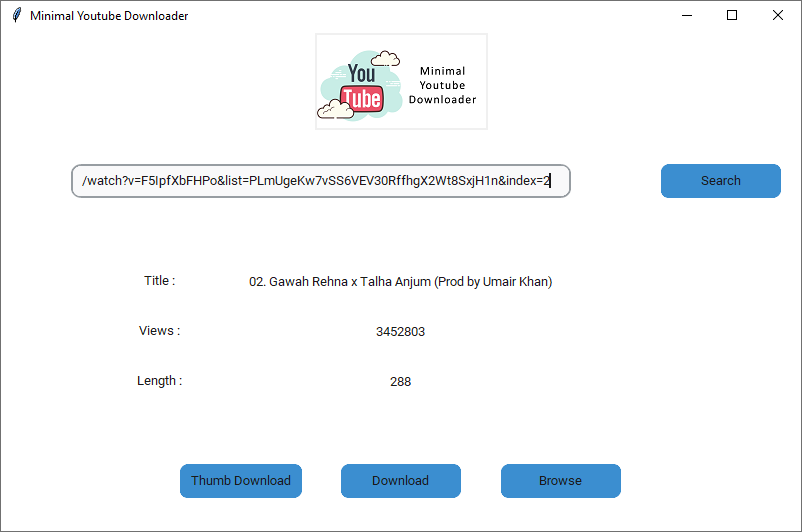
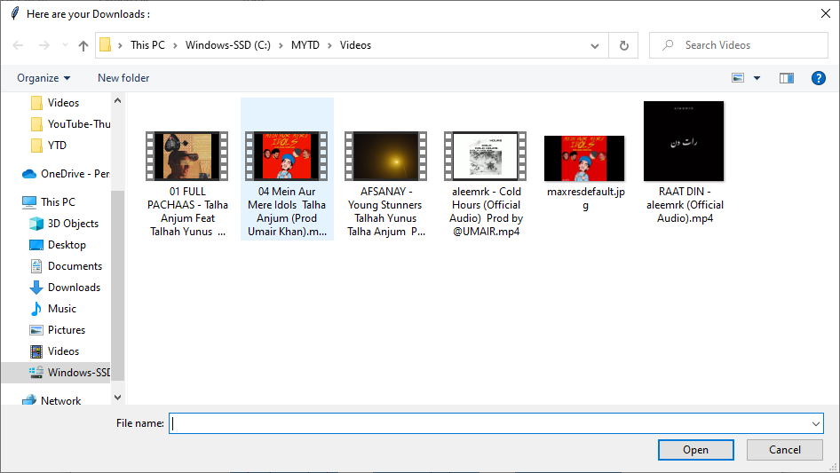

# Minimal-Youtube-Downloader
A Fully Functional yet minimal (Tkinter)GUI Based YouTube Downloader

# How To run
1. Install all the dependencies from requirenments.txt
2. Simply run the ytd.py file

#How To use
1. Copy the Youtube Video Link and Paste it in the app
2. Press Search Button to check the availability
3. Press Download Button to start downloading
4. Press Thumb Download button to download only the Thumbnail
5. Press Browse Button to look for the downloaded files
6. 

